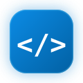
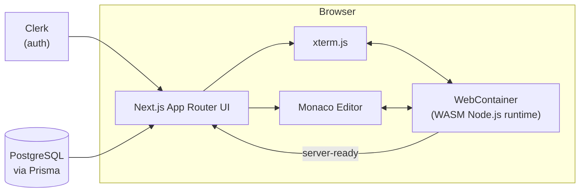

<div align="center">



# CodeForge

**Build in the browser.**
A focused, in-browser development workspace — a real editor, a real shell, and a real dev server, with nothing to install.

[](https://nextjs.org)
[](https://www.typescriptlang.org)
[](https://webcontainers.io)
[](./LICENSE)

</div>

---

## What is this

CodeForge is a browser-based IDE. Open a tab, get a full Node.js environment courtesy of [WebContainers](https://webcontainers.io) — file system, package manager, and a real interactive shell — all running client-side via WebAssembly, no server-side sandboxing required.

Scaffold a project with `npm create vite@latest`, run `npm install`, start a dev server, and watch it render live in the built-in preview pane — all without leaving the tab.

## Features

| | |
|---|---|
| 🖊️ **Editor** | Monaco (VS Code's editor) with multi-tab editing, dirty-state indicators, and a save-before-close prompt |
| 🌲 **File Explorer** | Right-click to create, rename, or delete files/folders — inline, VS Code-style, no dialog popups |
| 💻 **Terminal** | A real interactive shell (`jsh`) via WebContainers — pipes, history, `cd`, arrow keys, all of it. Session and scrollback persist across tab switches |
| 🔴 **Live Preview** | Auto-detects the dev server's port and renders it in an embedded frame, with reload and open-in-new-tab controls |
| 🔐 **Auth** | Sign-in / sign-up flow via [Clerk](https://clerk.com) |
| 📊 **Dashboard** | Project grid UI — search, star, and manage workspaces |

## Architecture



Everything left of the dashed line runs entirely client-side — the file system, the shell, and any dev server you start all live inside the WebContainer sandboxed in your tab. Nothing you type in the terminal touches a backend.

## Tech stack

- **Framework:** Next.js 16 (App Router), React 19, TypeScript
- **Runtime sandbox:** [`@webcontainer/api`](https://webcontainers.io) — in-browser Node.js, file system, and process spawning
- **Editor:** `@monaco-editor/react`
- **Terminal:** `@xterm/xterm` + `@xterm/addon-fit`
- **Auth:** Clerk
- **Database:** PostgreSQL + Prisma
- **Styling:** Tailwind CSS
- **Icons:** lucide-react

## Getting started

**Prerequisites:** Node.js 18+, a PostgreSQL database, and a [Clerk](https://clerk.com) application (for auth keys).

```bash
git clone https://github.com/Niket420/vibe_coding_platform.git
cd vibe_coding_platform/my-app
npm install
```

Create a `.env` file in `my-app/`:

```bash
NEXT_PUBLIC_CLERK_PUBLISHABLE_KEY=your_clerk_publishable_key
CLERK_SECRET_KEY=your_clerk_secret_key
DATABASE_URL=your_postgres_connection_string
```

Then:

```bash
npx prisma generate
npm run dev
```

Open [http://localhost:3000](http://localhost:3000). CodeForge boots a WebContainer on the client, so it needs a browser with `SharedArrayBuffer` support (any recent Chrome, Edge, or Firefox) and — since the app sends the required cross-origin isolation headers itself — no extra server config on your end.

## Project structure

```
my-app/
├── app/
│   ├── page.tsx              # Landing page
│   ├── dashboard/             # Project dashboard
│   └── playground/            # The IDE itself
├── components/
│   ├── ide/                   # Editor, FileExplorer, Terminal, Preview
│   ├── dashboard/
│   └── landing/
├── lib/
│   ├── webcontainer.ts        # WebContainer singleton boot
│   └── filesystem.ts          # FS tree walker
└── prisma/
    └── schema.prisma
```

## Roadmap

- [ ] Persist dashboard projects to Postgres (currently UI-only)
- [ ] Real template scaffolding (React / Angular / Vue) on project creation
- [ ] AI assistant — chat, code review, inline debugging
- [ ] GitHub import/export
- [ ] One-click deploy to Vercel

## Contributing

Issues and PRs are welcome. This is an active work in progress, so expect things to move fast and break occasionally.

## License

[MIT](./LICENSE)
