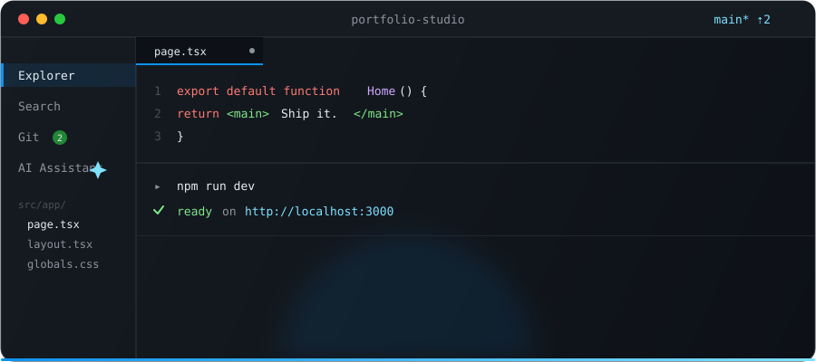
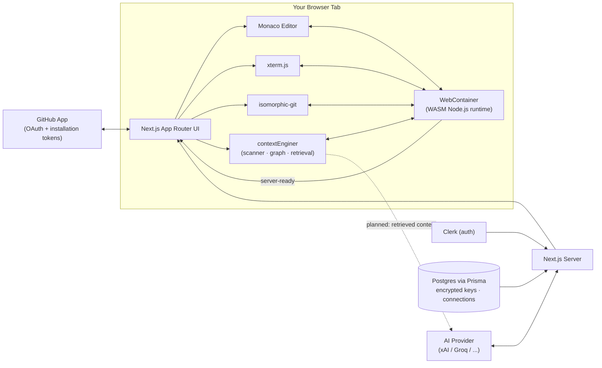

<div align="center">


# CodeForge

### A dev machine that lives in a browser tab.

Editor. Shell. Git. GitHub. An AI that actually sees your workspace.
No install, no Docker, no `ssh` — just a URL.

<br />

[](https://nextjs.org)
[](https://www.typescriptlang.org)
[](https://webcontainers.io)
[](./LICENSE)

<br />



</div>

---

## The pitch

You open a tab. Thirty seconds later you have a real Node.js environment —
file system, package manager, interactive shell — running entirely
**client-side in WebAssembly**. No server executes your code, no container
spins up on someone's cloud bill. It's just your browser, being far more
capable than you gave it credit for.

Then you `git init`, commit, connect GitHub, and ask an AI about the file
you're staring at — all without the tab ever losing focus.

## What's actually in here

Not a mockup. Not "coming soon." Here's what runs today:

| | |
|---|---|
| 🖊️ **Editor** | Monaco (yes, the real VS Code editor) — multi-tab, dirty-state dots, save-before-close guard, diff view for any commit |
| 💻 **Terminal** | A genuine interactive shell (`jsh`) inside the WebContainer — pipes, history, arrow keys. Survives tab switches; your `npm run dev` keeps running while you read a file |
| 🌲 **File Explorer** | Right-click create / rename / delete, inline — no modal dialogs pretending to be native |
| 🔴 **Live Preview** | Auto-detects your dev server's port, renders it in a resizable side panel with reload + open-in-tab |
| 🌿 **Git, for real** | Full local git via `isomorphic-git` — stage, commit, branch, checkout, tag, remotes, and a scrollable history with per-commit diffs. Not a wrapper around a CLI you don't have; it's git, compiled to run in your tab |
| 🐙 **GitHub, connected** | GitHub App OAuth, repo browser, clone (with smart conflict-overwrite prompts), fetch/pull/push using short-lived installation tokens — your PAT never touches this app |
| ✦ **AI Assistant** | A sidebar copilot with a real provider-picker: xAI/Grok, Groq, OpenAI, Anthropic, Gemini, OpenRouter, a custom OpenAI-compatible endpoint, or a local Ollama model. Keys are AES-256-GCM encrypted at rest, decrypted only server-side, never logged. **Grok and Groq are wired to real chat completions today**; the rest have a finished config UI waiting on their backend call |
| ⌘K **Command palette** | Fuzzy-jump to any file or panel without touching the mouse |
| 🔐 **Auth & data** | Clerk for sign-in, Postgres + Prisma for connections — themed to match, not bolted on |

### 🧠 Under active construction: the context engine

`contextEnginer/` is a standalone TypeScript package that will make good on the
tagline — an assistant that reads your workspace instead of guessing at it.
It's not a wrapper around embeddings; it's a proper code-intelligence
pipeline that runs against the live WebContainer filesystem:

1. **`FileScanner`** walks the workspace and classifies every source file.
2. **`CodeParser`** (built on `web-tree-sitter`) turns each file into a
   structured `ParsedFile` — its imports, exports, functions, classes.
3. **`SymbolIndex`** and **`ImportResolver`** turn those into a queryable
   symbol table and resolved module graph.
4. **`CodeGraph`** stitches files together by `imports`/`exports` edges, so
   "what does this file touch?" is a graph traversal, not a grep.
5. **`ContextWatcher`** / **`FileWatcher`** keep all of the above in sync as
   files change, instead of re-indexing from scratch.
6. A **hybrid retriever** — `LexicalRetriever` + `SymbolRetriever` +
   `GraphRetriever`, merged by a `CandidateScorer` — will turn "answer this
   question" into "here are the exact files and symbols that matter."

Scanner, parser, index, and graph are implemented; retrieval and scoring are
being built out now, and it isn't wired into the AI chat route yet — see
[Roadmap](#roadmap).

## Architecture



Everything inside the tab boundary — files, shell, running dev server — never
leaves your browser. The server's job is small and deliberate: mint GitHub
tokens, decrypt an AI key for one outbound call, and get out of the way.

## Tech stack

| Layer | Choice |
|---|---|
| Framework | Next.js 16 (App Router) · React 19 · TypeScript 5 |
| Sandbox runtime | [`@webcontainer/api`](https://webcontainers.io) — in-browser Node.js |
| Editor | `@monaco-editor/react` |
| Terminal | `@xterm/xterm` + `@xterm/addon-fit` |
| Version control | `isomorphic-git` (local) + a GitHub App (remote) |
| Context engine | `contextEnginer/` — `web-tree-sitter` parser, symbol index, import/code graph, hybrid retrieval (in development) |
| AI | Provider-agnostic chat layer, OpenAI-compatible transport |
| Auth | Clerk |
| Database | PostgreSQL + Prisma |
| Styling | Tailwind CSS v4 |
| Icons | lucide-react |

## Getting started

**Prerequisites:** Node.js 18+, a PostgreSQL database, a [Clerk](https://clerk.com) app, and — if you want Git features — a [GitHub App](https://docs.github.com/en/apps/creating-github-apps) of your own.

```bash
git clone https://github.com/Niket420/vibe_coding_platform.git
cd vibe_coding_platform/my-app
npm install
```

Create `.env.local`:

```bash
NEXT_PUBLIC_CLERK_PUBLISHABLE_KEY=your_clerk_publishable_key
CLERK_SECRET_KEY=your_clerk_secret_key
DATABASE_URL=your_postgres_connection_string

# GitHub App (for clone / fetch / pull / push)
GITHUB_APP_ID=your_github_app_id
GITHUB_PRIVATE_KEY=your_github_app_private_key

# AI key encryption (32-byte hex string — `openssl rand -hex 32`)
AI_ENCRYPTION_KEY=your_32_byte_hex_key
```

Then:

```bash
npx prisma generate
npx prisma db push
npm run dev
```

Open [http://localhost:3000](http://localhost:3000). CodeForge boots a
WebContainer client-side, so you need a browser with `SharedArrayBuffer`
support (any recent Chrome, Edge, or Firefox) — the app sends its own
cross-origin isolation headers, so there's nothing extra to configure.

## Keyboard shortcuts

| Shortcut | Does |
|---|---|
| `⌘K` / `Ctrl+K` | Open the command palette — jump to a file or a panel |
| `⌘S` / `Ctrl+S` | Save the active file |
| `⌘⏎` / `Ctrl+⏎` | Commit staged changes (from the commit message box) |
| `⇧⏎` | Newline in the AI chat input (plain `⏎` sends) |

## Project structure

```
my-app/
├── app/
│   ├── page.tsx                  # Landing page
│   ├── dashboard/                # Project dashboard
│   ├── playground/               # The IDE itself
│   └── api/
│       ├── ai/                   # Provider config + chat proxy
│       └── github/               # OAuth, clone, fetch/pull/push
├── components/
│   ├── ide/
│   │   ├── AI/                   # Assistant, provider picker, chat UI
│   │   ├── Editor.tsx  FileExplorer.tsx  Terminal.tsx  Preview.tsx
│   │   └── GitSourceControl.tsx  GitHubRepositories.tsx
│   └── dashboard/
├── lib/
│   ├── webcontainer.ts           # WebContainer singleton boot
│   ├── git.ts  git-fs.ts         # isomorphic-git + WebContainer FS bridge
│   ├── github.ts                 # GitHub App token minting
│   └── encryption.ts             # AES-256-GCM for stored API keys
├── contextEnginer/                # Standalone code-intelligence package
│   └── src/
│       ├── scanner/               # FileScanner — walks the workspace
│       ├── parser/                # web-tree-sitter → ParsedFile
│       ├── graph/                 # CodeGraph (import/export edges)
│       ├── index/                 # SymbolIndex, ContextIndex, ContextWatcher
│       ├── resolver/              # ImportResolver
│       ├── retrieval/             # Lexical / Symbol / Graph retrievers + scorer
│       └── watcher/               # FileWatcher for incremental re-indexing
└── prisma/
    └── schema.prisma
```

## Roadmap

**Shipped this cycle:** full local git, GitHub App integration, and a
working multi-provider AI assistant — these used to be roadmap bullets.

- [ ] Finish the hybrid retriever in `contextEnginer/` (`CandidateScorer` is the current piece in progress) and wire it into `/api/ai/chat` so the assistant answers from real retrieved context, not just the open file
- [ ] Persist dashboard projects to Postgres (currently a UI mock)
- [ ] Real template scaffolding — picking "React" should write files, not just navigate
- [ ] Wire the remaining AI providers (OpenAI, Anthropic, Gemini, OpenRouter, Custom, Local) to live chat calls
- [ ] One-click deploy to Vercel

## Contributing

Issues and PRs welcome. This moves fast and occasionally breaks — that's
the deal with building in public.

## License

[MIT](./LICENSE)
